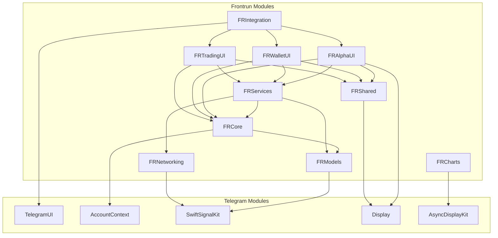

# Crypto Trading Tabs Architecture Plan

---
title: "feat: Add Alpha, Wallet, and Inline Trading Features"
type: feat
date: 2026-01-24
---

## Overview

This plan defines the engineering architecture for adding three major crypto trading features to Frontrun iOS (a Telegram fork):

1. **Alpha Tab** - AI-extracted signals and alerts feed
2. **Wallet/Portfolio Tab** - Wallet management and portfolio viewing
3. **Inline Trading Interface** - Contract address detection with quick buy in chat

The primary architectural goal is to **minimize merge conflicts with upstream Telegram** while creating a **maintainable, high-performance, and idiomatic Swift codebase**.

---

## Table of Contents

1. [Architectural Principles](#1-architectural-principles)
2. [Module Structure](#2-module-structure)
3. [Merge Conflict Minimization Strategy](#3-merge-conflict-minimization-strategy)
4. [Tab Integration Architecture](#4-tab-integration-architecture)
5. [Shared Components](#5-shared-components)
6. [Data Layer Architecture](#6-data-layer-architecture)
7. [Security Architecture](#7-security-architecture)
8. [Implementation Phases](#8-implementation-phases)
9. [Technical Specifications](#9-technical-specifications)
10. [Open Questions](#10-open-questions)
11. [File Structure](#11-file-structure)

---

## 1. Architectural Principles

### 1.1 Fork Maintenance First

Based on analysis of successful Telegram forks (Nicegram with 26 modules, Swiftgram with 49 modules), we adopt these principles:

| Principle | Rationale |
|-----------|-----------|
| **Isolation over Integration** | Custom code in dedicated directories minimizes upstream merge conflicts |
| **Extension over Modification** | Use Swift extensions rather than modifying Telegram core files |
| **Composition over Inheritance** | Match Telegram's existing architectural patterns |
| **Protocol-based Boundaries** | Define clear interfaces between Frontrun and Telegram code |

### 1.2 Performance Requirements

| Metric | Target | Rationale |
|--------|--------|-----------|
| Tab switch latency | < 100ms | Match Telegram's snappy navigation |
| Price update frequency | 1-2 Hz for visible tokens | Balance freshness vs battery |
| Chart render | 60 FPS for < 500 data points | Smooth interaction |
| Transaction submission | < 2s to pending state | User confidence in action |

### 1.3 Existing Patterns to Follow

The codebase already establishes these patterns (from `FrontrunAIModule`, `FrontrunCryptoModule`):

```swift
// Pattern 1: Configuration storage with UserDefaults
public final class XXXConfigurationStorage {
    private let userDefaultsKey = "telegram.xxx.configuration"
    public static let shared = XXXConfigurationStorage()
}

// Pattern 2: Signal-based reactive APIs
func fetchData() -> Signal<Model, FetchError>

// Pattern 3: ItemList-based settings UI
public func xxxSettingsController(context: AccountContext) -> ViewController

// Pattern 4: Component-based modal sheets
final class XXXSheetScreen: ViewControllerComponentContainer
```

---

## 2. Module Structure

### 2.1 Recommended Directory Layout

Following the `FR*` prefix convention (consistent with Nicegram's `NG*` and Swiftgram's `SG*`):

```
frontrun-ios/
├── Frontrun/                          # NEW: All Frontrun-specific code
│   ├── FRCore/                        # Core utilities and DI
│   │   ├── BUILD
│   │   └── Sources/
│   │       ├── FrontrunContext.swift  # Dependency container
│   │       ├── FrontrunFeatures.swift # Feature flags
│   │       └── FrontrunHooks.swift    # Integration points
│   │
│   ├── FRModels/                      # Shared data models
│   │   ├── BUILD
│   │   └── Sources/
│   │       ├── Token.swift
│   │       ├── Wallet.swift
│   │       ├── Trade.swift
│   │       ├── AlphaSignal.swift
│   │       └── Transaction.swift
│   │
│   ├── FRServices/                    # Business logic services
│   │   ├── BUILD
│   │   └── Sources/
│   │       ├── WalletService.swift
│   │       ├── TradingService.swift
│   │       ├── PriceService.swift
│   │       ├── AlphaExtractionService.swift
│   │       └── TokenMetadataService.swift
│   │
│   ├── FRNetworking/                  # Network layer
│   │   ├── BUILD
│   │   └── Sources/
│   │       ├── RPCClient.swift
│   │       ├── DexAggregatorClient.swift
│   │       └── PriceFeedClient.swift
│   │
│   ├── FRAlphaUI/                     # Alpha tab UI
│   │   ├── BUILD
│   │   └── Sources/
│   │       ├── AlphaTabController.swift
│   │       ├── AlphaFeedNode.swift
│   │       ├── AlphaCardNode.swift
│   │       ├── AlphaDetailController.swift
│   │       └── AlphaFilterSheet.swift
│   │
│   ├── FRWalletUI/                    # Wallet tab UI
│   │   ├── BUILD
│   │   └── Sources/
│   │       ├── WalletTabController.swift
│   │       ├── PortfolioNode.swift
│   │       ├── HoldingRowNode.swift
│   │       ├── TokenDetailController.swift
│   │       ├── WalletOnboardingController.swift
│   │       └── ActivityListController.swift
│   │
│   ├── FRTradingUI/                   # Trading UI components
│   │   ├── BUILD
│   │   └── Sources/
│   │       ├── InlineTokenWidget.swift
│   │       ├── QuickBuySheet.swift
│   │       ├── TransactionStatusView.swift
│   │       └── SlippageSettingsSheet.swift
│   │
│   ├── FRCharts/                      # Chart components
│   │   ├── BUILD
│   │   └── Sources/
│   │       ├── PriceChartNode.swift
│   │       ├── FullscreenChartController.swift
│   │       └── ChartDataManager.swift
│   │
│   ├── FRShared/                      # Shared UI components
│   │   ├── BUILD
│   │   └── Sources/
│   │       ├── TokenQuickView.swift
│   │       ├── AddressCopyButton.swift
│   │       ├── PriceLabel.swift
│   │       └── ChainBadge.swift
│   │
│   └── FRIntegration/                 # Telegram integration layer
│       ├── BUILD
│       └── Sources/
│           ├── TelegramRootController+Frontrun.swift
│           ├── ChatController+TokenDetection.swift
│           └── FrontrunTabProvider.swift
│
├── submodules/
│   ├── FrontrunAIModule/              # EXISTING: Keep, migrate to Frontrun/
│   ├── FrontrunCryptoModule/          # EXISTING: Keep, migrate to Frontrun/
│   └── ... (Telegram modules)
│
└── Telegram/                          # Upstream Telegram (minimal changes)
```

### 2.2 Module Dependencies



### 2.3 BUILD File Template

```python
# File: Frontrun/FRCore/BUILD
load("@build_bazel_rules_swift//swift:swift.bzl", "swift_library")

swift_library(
    name = "FRCore",
    module_name = "FRCore",
    srcs = glob(["Sources/**/*.swift"]),
    copts = ["-warnings-as-errors"],
    deps = [
        "//submodules/SSignalKit/SwiftSignalKit:SwiftSignalKit",
        "//submodules/AccountContext:AccountContext",
        "//Frontrun/FRModels:FRModels",
    ],
    visibility = ["//visibility:public"],
)
```

---

## 3. Merge Conflict Minimization Strategy

### 3.1 Upstream Sync Workflow

```bash
# Weekly sync ritual
git fetch upstream
git checkout -b sync/upstream-$(date +%Y%m%d)
git merge upstream/master
# Resolve conflicts (should be minimal with this architecture)
git push origin sync/upstream-$(date +%Y%m%d)
# Create PR, test thoroughly
```

### 3.2 Files to Modify in Telegram (Minimal Touch Points)

Only these files require modification in upstream Telegram code:

| File | Change Required | Conflict Risk |
|------|-----------------|---------------|
| `submodules/TelegramUI/BUILD` | Add Frontrun module dependencies | LOW - append-only |
| `submodules/TelegramUI/Sources/TelegramRootController.swift` | Add Frontrun tab registration | MEDIUM - hook insertion |
| `submodules/TelegramUI/Sources/Chat/ChatController.swift` | Token detection hook | MEDIUM - hook insertion |

### 3.3 Extension-Based Integration Pattern

Instead of modifying core files, use Swift extensions:

```swift
// File: Frontrun/FRIntegration/Sources/TelegramRootController+Frontrun.swift

import TelegramUI
import FRAlphaUI
import FRWalletUI

extension TelegramRootController {

    /// Call this from `addRootControllers` to inject Frontrun tabs
    func addFrontrunTabs(to controllers: inout [ViewController]) {
        guard FrontrunFeatures.tradingEnabled else { return }

        let frontrunContext = FrontrunContext(telegramContext: self.context)

        // Insert before Settings tab (last position)
        let insertIndex = max(0, controllers.count - 1)

        if FrontrunFeatures.alphaTabEnabled {
            let alphaTab = AlphaTabController(context: frontrunContext)
            controllers.insert(alphaTab, at: insertIndex)
        }

        if FrontrunFeatures.walletTabEnabled {
            let walletTab = WalletTabController(context: frontrunContext)
            controllers.insert(walletTab, at: insertIndex)
        }
    }
}
```

### 3.4 Single Integration Point in TelegramRootController

The only required modification to `TelegramRootController.swift`:

```swift
// In addRootControllers(showCallsTab:)
// ADD these lines after building the controllers array:

#if FRONTRUN
import FRIntegration
// Insert Frontrun tabs
self.addFrontrunTabs(to: &controllers)
#endif
```

This uses a compiler flag (`FRONTRUN`) that can be set in the build configuration, making the integration trivially reversible and conflict-resistant.

---

## 4. Tab Integration Architecture

### 4.1 Tab Provider Protocol

```swift
// File: Frontrun/FRCore/Sources/FrontrunTabProvider.swift

public protocol FrontrunTabProvider {
    /// Returns controllers to add to the tab bar
    func controllers(for context: FrontrunContext) -> [ViewController]

    /// Index where tabs should be inserted (relative to existing tabs)
    /// Negative values count from end (-1 = before last tab)
    var insertionIndex: Int { get }

    /// Whether this provider's tabs are currently enabled
    var isEnabled: Bool { get }
}

// Registry for tab providers
public final class FrontrunTabRegistry {
    public static let shared = FrontrunTabRegistry()

    private var providers: [FrontrunTabProvider] = []

    public func register(_ provider: FrontrunTabProvider) {
        providers.append(provider)
    }

    public func allControllers(for context: FrontrunContext) -> [ViewController] {
        return providers
            .filter { $0.isEnabled }
            .sorted { $0.insertionIndex < $1.insertionIndex }
            .flatMap { $0.controllers(for: context) }
    }
}
```

### 4.2 Alpha Tab Controller

```swift
// File: Frontrun/FRAlphaUI/Sources/AlphaTabController.swift

import Display
import AccountContext
import FRCore
import FRServices

public final class AlphaTabController: ViewController {
    private let context: FrontrunContext
    private var controllerNode: AlphaFeedNode {
        return self.displayNode as! AlphaFeedNode
    }

    private let statePromise = ValuePromise<AlphaFeedState>(ignoreRepeated: true)
    private var stateValue: AlphaFeedState = .loading {
        didSet { statePromise.set(stateValue) }
    }

    private let disposeBag = DisposableSet()

    public init(context: FrontrunContext) {
        self.context = context

        super.init(navigationBarPresentationData: nil)

        self.tabBarItem.title = "Alpha"
        self.tabBarItem.image = UIImage(named: "TabAlpha")
        self.tabBarItem.selectedImage = UIImage(named: "TabAlphaFilled")
    }

    required init(coder: NSCoder) {
        fatalError("init(coder:) has not been implemented")
    }

    override public func loadDisplayNode() {
        self.displayNode = AlphaFeedNode(context: context)
        self.displayNodeDidLoad()
    }

    override public func viewDidLoad() {
        super.viewDidLoad()
        subscribeToAlphaFeed()
    }

    private func subscribeToAlphaFeed() {
        let alphaService = context.alphaService

        disposeBag.add(
            alphaService.signals
                .deliverOnMainQueue()
                .start(next: { [weak self] signals in
                    self?.stateValue = .loaded(signals)
                }, error: { [weak self] error in
                    self?.stateValue = .error(error)
                })
        )
    }

    deinit {
        disposeBag.dispose()
    }
}
```

### 4.3 Wallet Tab Controller

```swift
// File: Frontrun/FRWalletUI/Sources/WalletTabController.swift

import Display
import FRCore
import FRServices

public final class WalletTabController: ViewController {
    private let context: FrontrunContext

    private enum State {
        case noWallet
        case loading
        case loaded(Portfolio)
        case error(WalletError)
    }

    private let statePromise = ValuePromise<State>(ignoreRepeated: false)
    private var stateValue: State = .loading {
        didSet { statePromise.set(stateValue) }
    }

    private let disposeBag = DisposableSet()

    public init(context: FrontrunContext) {
        self.context = context

        super.init(navigationBarPresentationData: nil)

        self.tabBarItem.title = "Wallet"
        self.tabBarItem.image = UIImage(named: "TabWallet")
        self.tabBarItem.selectedImage = UIImage(named: "TabWalletFilled")
    }

    required init(coder: NSCoder) {
        fatalError("init(coder:) has not been implemented")
    }

    override public func loadDisplayNode() {
        switch stateValue {
        case .noWallet:
            self.displayNode = WalletOnboardingNode(context: context, delegate: self)
        default:
            self.displayNode = PortfolioNode(context: context)
        }
        self.displayNodeDidLoad()
    }

    override public func viewDidLoad() {
        super.viewDidLoad()
        checkWalletStatus()
    }

    private func checkWalletStatus() {
        let walletService = context.walletService

        if walletService.hasWallet {
            loadPortfolio()
        } else {
            stateValue = .noWallet
        }
    }

    private func loadPortfolio() {
        stateValue = .loading

        disposeBag.add(
            context.walletService.portfolio
                .deliverOnMainQueue()
                .start(next: { [weak self] portfolio in
                    self?.stateValue = .loaded(portfolio)
                }, error: { [weak self] error in
                    self?.stateValue = .error(error)
                })
        )
    }

    deinit {
        disposeBag.dispose()
    }
}
```

---

## 5. Shared Components

### 5.1 Token Quick View

```swift
// File: Frontrun/FRShared/Sources/TokenQuickView.swift

import Display
import AsyncDisplayKit
import FRCore
import FRCharts

public final class TokenQuickViewSheet: ViewControllerComponentContainer {
    private let token: Token
    private let context: FrontrunContext

    public init(token: Token, context: FrontrunContext) {
        self.token = token
        self.context = context

        super.init(
            context: context.telegramContext,
            component: TokenQuickViewComponent(token: token, context: context),
            navigationBarAppearance: .none,
            theme: .default
        )
    }

    required init(coder: NSCoder) {
        fatalError("init(coder:) has not been implemented")
    }
}

// Component-based implementation
final class TokenQuickViewComponent: Component {
    let token: Token
    let context: FrontrunContext

    init(token: Token, context: FrontrunContext) {
        self.token = token
        self.context = context
    }

    func makeView() -> View {
        return View(frame: .zero)
    }

    func update(view: View, availableSize: CGSize, state: EmptyComponentState, environment: Environment<Empty>, transition: ComponentTransition) -> CGSize {
        // Layout token header, chart, metrics, actions
        return availableSize
    }
}
```

### 5.2 Inline Token Widget (for Chat)

```swift
// File: Frontrun/FRTradingUI/Sources/InlineTokenWidget.swift

import Display
import AsyncDisplayKit
import FRCore
import FRModels

/// Inline widget displayed under messages containing contract addresses
public final class InlineTokenWidgetNode: ASDisplayNode {
    private let token: Token
    private let context: FrontrunContext

    // UI Elements
    private let containerNode: ASDisplayNode
    private let tokenIconNode: ASImageNode
    private let tokenNameLabel: ASTextNode
    private let addressNode: AddressCopyButton
    private let chainBadge: ChainBadgeNode
    private let chartButton: HighlightableButtonNode
    private let quickBuyButton: HighlightableButtonNode
    private let moreButton: HighlightableButtonNode

    public var onChartTapped: (() -> Void)?
    public var onQuickBuyTapped: (() -> Void)?
    public var onMoreTapped: (() -> Void)?

    public init(token: Token, context: FrontrunContext) {
        self.token = token
        self.context = context

        self.containerNode = ASDisplayNode()
        self.tokenIconNode = ASImageNode()
        self.tokenNameLabel = ASTextNode()
        self.addressNode = AddressCopyButton(address: token.address)
        self.chainBadge = ChainBadgeNode(chain: token.chain)
        self.chartButton = HighlightableButtonNode()
        self.quickBuyButton = HighlightableButtonNode()
        self.moreButton = HighlightableButtonNode()

        super.init()

        setupNodes()
        setupActions()
    }

    private func setupNodes() {
        containerNode.backgroundColor = UIColor.secondarySystemBackground
        containerNode.cornerRadius = 12

        tokenNameLabel.attributedText = NSAttributedString(
            string: token.name ?? "Unknown Token",
            attributes: [.font: UIFont.systemFont(ofSize: 15, weight: .semibold)]
        )

        chartButton.setTitle("Chart", with: .systemFont(ofSize: 14, weight: .medium), with: .systemBlue, for: .normal)
        quickBuyButton.setTitle("Quick Buy", with: .systemFont(ofSize: 14, weight: .semibold), with: .white, for: .normal)
        quickBuyButton.backgroundColor = .systemGreen
        quickBuyButton.cornerRadius = 8

        addSubnode(containerNode)
        containerNode.addSubnode(tokenIconNode)
        containerNode.addSubnode(tokenNameLabel)
        containerNode.addSubnode(addressNode)
        containerNode.addSubnode(chainBadge)
        containerNode.addSubnode(chartButton)
        containerNode.addSubnode(quickBuyButton)
        containerNode.addSubnode(moreButton)
    }

    private func setupActions() {
        chartButton.addTarget(self, action: #selector(chartTapped), forControlEvents: .touchUpInside)
        quickBuyButton.addTarget(self, action: #selector(quickBuyTapped), forControlEvents: .touchUpInside)
        moreButton.addTarget(self, action: #selector(moreTapped), forControlEvents: .touchUpInside)
    }

    @objc private func chartTapped() { onChartTapped?() }
    @objc private func quickBuyTapped() { onQuickBuyTapped?() }
    @objc private func moreTapped() { onMoreTapped?() }

    override public func calculateSizeThatFits(_ constrainedSize: CGSize) -> CGSize {
        return CGSize(width: constrainedSize.width, height: 80)
    }

    override public func layout() {
        super.layout()
        // Layout implementation
    }
}
```

### 5.3 Quick Buy Sheet

```swift
// File: Frontrun/FRTradingUI/Sources/QuickBuySheet.swift

import Display
import FRCore
import FRServices

public final class QuickBuySheet: ViewControllerComponentContainer {

    public enum State: Equatable {
        case configuring(QuickBuyConfig)
        case confirming(QuickBuyConfig, Quote)
        case signing
        case submitting
        case pending(txHash: String)
        case success(txHash: String)
        case failed(error: String)
    }

    private let token: Token
    private let context: FrontrunContext
    private let statePromise = ValuePromise<State>(ignoreRepeated: true)

    public init(token: Token, context: FrontrunContext) {
        self.token = token
        self.context = context

        let initialConfig = QuickBuyConfig(
            token: token,
            amount: .preset(.medium),
            slippage: 0.5,
            priorityFee: .normal
        )

        super.init(
            context: context.telegramContext,
            component: QuickBuyComponent(
                token: token,
                config: initialConfig,
                state: .configuring(initialConfig),
                context: context
            ),
            navigationBarAppearance: .none,
            theme: .default
        )

        statePromise.set(.configuring(initialConfig))
    }

    required init(coder: NSCoder) {
        fatalError("init(coder:) has not been implemented")
    }

    func confirmPurchase(config: QuickBuyConfig) {
        // Fetch quote, then move to confirming state
        let tradingService = context.tradingService

        _ = tradingService.getQuote(for: config)
            .deliverOnMainQueue()
            .start(next: { [weak self] quote in
                self?.statePromise.set(.confirming(config, quote))
            }, error: { [weak self] error in
                self?.statePromise.set(.failed(error: error.localizedDescription))
            })
    }

    func executeTrade(config: QuickBuyConfig, quote: Quote) {
        statePromise.set(.signing)

        let tradingService = context.tradingService
        let walletService = context.walletService

        _ = tradingService.buildTransaction(config: config, quote: quote)
            .flatMap { tx in
                walletService.sign(transaction: tx)
            }
            .flatMap { signedTx in
                self.statePromise.set(.submitting)
                return tradingService.submit(signedTransaction: signedTx)
            }
            .deliverOnMainQueue()
            .start(next: { [weak self] txHash in
                self?.statePromise.set(.pending(txHash: txHash))
                self?.pollForConfirmation(txHash: txHash)
            }, error: { [weak self] error in
                self?.statePromise.set(.failed(error: error.localizedDescription))
            })
    }

    private func pollForConfirmation(txHash: String) {
        // Poll RPC for transaction confirmation
        _ = context.tradingService.waitForConfirmation(txHash: txHash)
            .deliverOnMainQueue()
            .start(next: { [weak self] _ in
                self?.statePromise.set(.success(txHash: txHash))
            }, error: { [weak self] error in
                self?.statePromise.set(.failed(error: error.localizedDescription))
            })
    }
}
```

---

## 6. Data Layer Architecture

### 6.1 FrontrunContext (Dependency Container)

```swift
// File: Frontrun/FRCore/Sources/FrontrunContext.swift

import AccountContext
import SwiftSignalKit
import FRServices
import FRNetworking

public final class FrontrunContext {
    public let telegramContext: AccountContext

    // Services (lazy initialization)
    public lazy var walletService: WalletServiceProtocol = {
        WalletService(storage: WalletStorage())
    }()

    public lazy var tradingService: TradingServiceProtocol = {
        TradingService(
            rpcClient: rpcClient,
            dexClient: dexClient
        )
    }()

    public lazy var priceService: PriceServiceProtocol = {
        PriceService(priceFeedClient: priceFeedClient)
    }()

    public lazy var alphaService: AlphaServiceProtocol = {
        AlphaExtractionService(
            telegramContext: telegramContext,
            aiService: aiService
        )
    }()

    public lazy var tokenMetadataService: TokenMetadataServiceProtocol = {
        TokenMetadataService()
    }()

    // Network clients
    private lazy var rpcClient: RPCClient = {
        RPCClient(endpoints: FrontrunConfig.shared.rpcEndpoints)
    }()

    private lazy var dexClient: DexAggregatorClient = {
        JupiterClient() // Solana DEX aggregator
    }()

    private lazy var priceFeedClient: PriceFeedClient = {
        BirdeyePriceFeedClient()
    }()

    private lazy var aiService: AIServiceProtocol = {
        // Use existing FrontrunAIModule
        AIService.shared
    }()

    public init(telegramContext: AccountContext) {
        self.telegramContext = telegramContext
    }
}
```

### 6.2 Service Protocols

```swift
// File: Frontrun/FRServices/Sources/Protocols/WalletServiceProtocol.swift

public protocol WalletServiceProtocol {
    var hasWallet: Bool { get }
    var currentWallet: Signal<Wallet?, NoError> { get }
    var portfolio: Signal<Portfolio, WalletError> { get }

    func createWallet() -> Signal<Wallet, WalletError>
    func importWallet(seedPhrase: String) -> Signal<Wallet, WalletError>
    func importWallet(privateKey: String) -> Signal<Wallet, WalletError>
    func sign(transaction: Transaction) -> Signal<SignedTransaction, WalletError>
    func deleteWallet(id: String) -> Signal<Void, WalletError>
}

// File: Frontrun/FRServices/Sources/Protocols/TradingServiceProtocol.swift

public protocol TradingServiceProtocol {
    func getQuote(for config: QuickBuyConfig) -> Signal<Quote, TradingError>
    func buildTransaction(config: QuickBuyConfig, quote: Quote) -> Signal<Transaction, TradingError>
    func submit(signedTransaction: SignedTransaction) -> Signal<String, TradingError>
    func waitForConfirmation(txHash: String) -> Signal<TransactionStatus, TradingError>
}

// File: Frontrun/FRServices/Sources/Protocols/PriceServiceProtocol.swift

public protocol PriceServiceProtocol {
    func price(for token: String) -> Signal<Decimal, PriceError>
    func priceStream(for tokens: [String]) -> Signal<[String: Decimal], NoError>
    func chartData(for token: String, timeframe: ChartTimeframe) -> Signal<[PricePoint], PriceError>
}
```

### 6.3 Data Models

```swift
// File: Frontrun/FRModels/Sources/Token.swift

public struct Token: Equatable, Codable, Identifiable {
    public let id: String // Contract address
    public let address: String
    public let chain: Chain
    public let symbol: String?
    public let name: String?
    public let decimals: Int
    public let logoURL: URL?
    public let isVerified: Bool
    public let riskLevel: RiskLevel

    public enum Chain: String, Codable {
        case solana
        case ethereum
        case base
        // Add more as needed
    }

    public enum RiskLevel: String, Codable {
        case safe
        case unknown
        case warning
        case danger
    }
}

// File: Frontrun/FRModels/Sources/Wallet.swift

public struct Wallet: Equatable, Codable, Identifiable {
    public let id: String
    public let name: String?
    public let address: String
    public let chain: Token.Chain
    public let createdAt: Date
    public let isBackedUp: Bool

    // Note: Private key is stored in Keychain, not here
}

// File: Frontrun/FRModels/Sources/Portfolio.swift

public struct Portfolio: Equatable {
    public let wallet: Wallet
    public let totalValueUSD: Decimal
    public let change24h: Decimal?
    public let holdings: [Holding]

    public struct Holding: Equatable, Identifiable {
        public var id: String { token.id }
        public let token: Token
        public let balance: Decimal
        public let valueUSD: Decimal
        public let change24h: Decimal?
    }
}

// File: Frontrun/FRModels/Sources/AlphaSignal.swift

public struct AlphaSignal: Equatable, Codable, Identifiable {
    public let id: String
    public let type: SignalType
    public let token: Token?
    public let source: Source
    public let timestamp: Date
    public let summary: String
    public let confidence: Double
    public let tags: [String]
    public let originalMessageId: Int64?
    public let originalChatId: Int64?

    public enum SignalType: String, Codable {
        case aiExtracted
        case walletAlert
        case xMonitor
        case botNotification
    }

    public struct Source: Equatable, Codable {
        public let name: String
        public let type: SourceType
        public let iconURL: URL?

        public enum SourceType: String, Codable {
            case telegramChat
            case telegramChannel
            case externalWallet
            case twitter
            case bot
        }
    }
}
```

---

## 7. Security Architecture

### 7.1 Key Storage

```swift
// File: Frontrun/FRServices/Sources/Security/KeychainStorage.swift

import Security
import LocalAuthentication

public final class SecureKeyStorage {
    private let serviceName = "com.frontrun.wallet"

    public enum KeyType: String {
        case privateKey = "pk"
        case seedPhrase = "seed"
    }

    /// Store key with Secure Enclave protection (if available)
    public func storeKey(
        _ keyData: Data,
        type: KeyType,
        walletId: String
    ) throws {
        let account = "\(type.rawValue).\(walletId)"

        var query: [String: Any] = [
            kSecClass as String: kSecClassGenericPassword,
            kSecAttrService as String: serviceName,
            kSecAttrAccount as String: account,
            kSecValueData as String: keyData
        ]

        // Use Secure Enclave if available (iPhone 5s+)
        if SecureEnclave.isAvailable {
            let access = SecAccessControlCreateWithFlags(
                nil,
                kSecAttrAccessibleWhenUnlockedThisDeviceOnly,
                [.privateKeyUsage, .biometryCurrentSet],
                nil
            )!
            query[kSecAttrAccessControl as String] = access
        } else {
            query[kSecAttrAccessible as String] = kSecAttrAccessibleWhenUnlockedThisDeviceOnly
        }

        // Delete existing (if any) then add
        SecItemDelete(query as CFDictionary)

        let status = SecItemAdd(query as CFDictionary, nil)
        guard status == errSecSuccess else {
            throw KeychainError.storeFailed(status)
        }
    }

    /// Retrieve key with biometric authentication
    public func retrieveKey(
        type: KeyType,
        walletId: String,
        reason: String
    ) async throws -> Data {
        let account = "\(type.rawValue).\(walletId)"

        let context = LAContext()
        context.localizedReason = reason

        let query: [String: Any] = [
            kSecClass as String: kSecClassGenericPassword,
            kSecAttrService as String: serviceName,
            kSecAttrAccount as String: account,
            kSecReturnData as String: true,
            kSecUseAuthenticationContext as String: context
        ]

        var result: AnyObject?
        let status = SecItemCopyMatching(query as CFDictionary, &result)

        guard status == errSecSuccess, let data = result as? Data else {
            throw KeychainError.retrieveFailed(status)
        }

        return data
    }

    public func deleteKey(type: KeyType, walletId: String) throws {
        let account = "\(type.rawValue).\(walletId)"

        let query: [String: Any] = [
            kSecClass as String: kSecClassGenericPassword,
            kSecAttrService as String: serviceName,
            kSecAttrAccount as String: account
        ]

        let status = SecItemDelete(query as CFDictionary)
        guard status == errSecSuccess || status == errSecItemNotFound else {
            throw KeychainError.deleteFailed(status)
        }
    }
}
```

### 7.2 Transaction Signing Flow

```swift
// File: Frontrun/FRServices/Sources/WalletService.swift

public final class WalletService: WalletServiceProtocol {
    private let storage: WalletStorage
    private let keyStorage: SecureKeyStorage

    public func sign(transaction: Transaction) -> Signal<SignedTransaction, WalletError> {
        return Signal { subscriber in
            Task {
                do {
                    // 1. Get current wallet
                    guard let wallet = self.storage.currentWallet else {
                        subscriber.putError(.noWallet)
                        return
                    }

                    // 2. Retrieve private key with biometric auth
                    let privateKeyData = try await self.keyStorage.retrieveKey(
                        type: .privateKey,
                        walletId: wallet.id,
                        reason: "Sign transaction for \(transaction.description)"
                    )

                    // 3. Sign transaction
                    let signedTx = try self.signTransaction(
                        transaction,
                        with: privateKeyData,
                        chain: wallet.chain
                    )

                    // 4. Zero out private key from memory
                    privateKeyData.resetBytes(in: 0..<privateKeyData.count)

                    subscriber.putNext(signedTx)
                    subscriber.putCompletion()

                } catch {
                    subscriber.putError(.signingFailed(error))
                }
            }

            return EmptyDisposable
        }
    }

    private func signTransaction(_ tx: Transaction, with key: Data, chain: Token.Chain) throws -> SignedTransaction {
        switch chain {
        case .solana:
            return try SolanaTransactionSigner.sign(tx, with: key)
        case .ethereum, .base:
            return try EVMTransactionSigner.sign(tx, with: key)
        }
    }
}
```

---

## 8. Implementation Phases

### Phase 1: Foundation (Week 1-2)

**Goal:** Establish module structure and core infrastructure

| Task | Description | Files |
|------|-------------|-------|
| Create `Frontrun/` directory structure | Set up all module directories with BUILD files | `Frontrun/*/BUILD` |
| Implement FRCore | FrontrunContext, FrontrunFeatures, FrontrunHooks | `Frontrun/FRCore/Sources/*.swift` |
| Implement FRModels | Token, Wallet, Portfolio, AlphaSignal models | `Frontrun/FRModels/Sources/*.swift` |
| Migrate existing modules | Move FrontrunAIModule, FrontrunCryptoModule under Frontrun/ | `Frontrun/FRAI/`, `Frontrun/FRCrypto/` |
| Set up tab integration hook | Minimal TelegramRootController modification | `FRIntegration/TelegramRootController+Frontrun.swift` |

**Acceptance Criteria:**
- [ ] All Frontrun modules compile without errors
- [ ] Feature flag system works (enable/disable tabs)
- [ ] Existing AI/Crypto functionality still works

### Phase 2: Wallet Infrastructure (Week 3-4)

**Goal:** Secure wallet creation, import, and storage

| Task | Description | Files |
|------|-------------|-------|
| Implement SecureKeyStorage | Keychain integration with Secure Enclave | `FRServices/Sources/Security/KeychainStorage.swift` |
| Implement WalletService | Create, import, list, delete wallets | `FRServices/Sources/WalletService.swift` |
| Implement WalletStorage | Wallet metadata persistence | `FRServices/Sources/Storage/WalletStorage.swift` |
| Build WalletOnboardingController | Create/import wallet flows | `FRWalletUI/Sources/WalletOnboardingController.swift` |
| Add biometric authentication | Face ID / Touch ID for signing | `FRServices/Sources/Security/BiometricAuth.swift` |

**Acceptance Criteria:**
- [ ] Can create new wallet with generated seed phrase
- [ ] Can import wallet via seed phrase or private key
- [ ] Private keys stored securely in Keychain
- [ ] Biometric required for transaction signing

### Phase 3: Wallet Tab UI (Week 5-6)

**Goal:** Complete Wallet/Portfolio tab with holdings display

| Task | Description | Files |
|------|-------------|-------|
| Implement PortfolioNode | Holdings list with real-time prices | `FRWalletUI/Sources/PortfolioNode.swift` |
| Implement HoldingRowNode | Individual token row with price/change | `FRWalletUI/Sources/HoldingRowNode.swift` |
| Implement TokenDetailController | Detailed token view with chart | `FRWalletUI/Sources/TokenDetailController.swift` |
| Implement ActivityListController | Transaction history | `FRWalletUI/Sources/ActivityListController.swift` |
| Implement price streaming | Real-time price updates | `FRServices/Sources/PriceService.swift` |

**Acceptance Criteria:**
- [ ] Portfolio tab shows all holdings with current prices
- [ ] Prices update in real-time (1-2 Hz)
- [ ] Can view token detail with chart
- [ ] Transaction history displays correctly

### Phase 4: Trading Infrastructure (Week 7-8)

**Goal:** DEX integration and transaction execution

| Task | Description | Files |
|------|-------------|-------|
| Implement JupiterClient | Jupiter DEX aggregator integration | `FRNetworking/Sources/JupiterClient.swift` |
| Implement RPCClient | Solana RPC with failover | `FRNetworking/Sources/RPCClient.swift` |
| Implement TradingService | Quote, build, submit transactions | `FRServices/Sources/TradingService.swift` |
| Implement QuickBuySheet | Amount selection, slippage, confirmation | `FRTradingUI/Sources/QuickBuySheet.swift` |
| Implement TransactionStatusView | Pending, success, failed states | `FRTradingUI/Sources/TransactionStatusView.swift` |

**Acceptance Criteria:**
- [ ] Can get swap quotes from Jupiter
- [ ] Can execute swaps with proper slippage
- [ ] Transaction status updates correctly
- [ ] Error handling for failed transactions

### Phase 5: Inline Trading (Week 9-10)

**Goal:** Contract address detection in chat with inline widget

| Task | Description | Files |
|------|-------------|-------|
| Implement CA detection | Regex detection for Solana/EVM addresses | `FRTradingUI/Sources/ContractAddressDetector.swift` |
| Implement InlineTokenWidget | Widget displayed under messages | `FRTradingUI/Sources/InlineTokenWidget.swift` |
| Implement TokenQuickView | Shared token detail sheet | `FRShared/Sources/TokenQuickView.swift` |
| Chat integration hook | Inject widget into ChatController | `FRIntegration/ChatController+TokenDetection.swift` |
| Implement token metadata fetching | Fetch name, symbol, logo for CA | `FRServices/Sources/TokenMetadataService.swift` |

**Acceptance Criteria:**
- [ ] CAs detected automatically in messages
- [ ] Inline widget shows token info
- [ ] Quick Buy accessible from widget
- [ ] Unknown tokens show warning

### Phase 6: Alpha Tab (Week 11-12)

**Goal:** AI-extracted signals feed

| Task | Description | Files |
|------|-------------|-------|
| Implement AlphaExtractionService | AI signal extraction from chats | `FRServices/Sources/AlphaExtractionService.swift` |
| Implement AlphaTabController | Main Alpha tab | `FRAlphaUI/Sources/AlphaTabController.swift` |
| Implement AlphaFeedNode | Signal cards list | `FRAlphaUI/Sources/AlphaFeedNode.swift` |
| Implement AlphaCardNode | Individual signal card | `FRAlphaUI/Sources/AlphaCardNode.swift` |
| Implement AlphaFilterSheet | Filter by source, time, type | `FRAlphaUI/Sources/AlphaFilterSheet.swift` |
| Implement AlphaDetailController | Full signal detail view | `FRAlphaUI/Sources/AlphaDetailController.swift` |

**Acceptance Criteria:**
- [ ] Alpha feed displays AI-extracted signals
- [ ] Can filter by signal type/source
- [ ] Can tap to view full detail
- [ ] Can navigate to original chat message

### Phase 7: Charts & Polish (Week 13-14)

**Goal:** Full-screen charts and UX polish

| Task | Description | Files |
|------|-------------|-------|
| Implement PriceChartNode | Interactive price chart | `FRCharts/Sources/PriceChartNode.swift` |
| Implement FullscreenChartController | Pinch/zoom/drag chart | `FRCharts/Sources/FullscreenChartController.swift` |
| Implement ChartDataManager | Efficient data windowing | `FRCharts/Sources/ChartDataManager.swift` |
| Polish animations | Smooth transitions throughout | Various files |
| Error state polish | Consistent error handling UI | Various files |
| Empty state polish | Consistent empty states | Various files |

**Acceptance Criteria:**
- [ ] Charts render at 60 FPS
- [ ] Full-screen chart with pinch/zoom
- [ ] Consistent error and empty states
- [ ] Smooth tab transitions

---

## 9. Technical Specifications

### 9.1 Contract Address Detection Regex

```swift
// File: Frontrun/FRTradingUI/Sources/ContractAddressDetector.swift

public final class ContractAddressDetector {

    // Solana: Base58, 32-44 characters
    private static let solanaPattern = #"[1-9A-HJ-NP-Za-km-z]{32,44}"#

    // Ethereum/EVM: 0x followed by 40 hex characters
    private static let evmPattern = #"0x[a-fA-F0-9]{40}"#

    private static let combinedRegex: NSRegularExpression = {
        try! NSRegularExpression(
            pattern: "(\(solanaPattern))|(\(evmPattern))",
            options: []
        )
    }()

    public struct Detection {
        public let address: String
        public let chain: Token.Chain
        public let range: Range<String.Index>
    }

    public static func detect(in text: String) -> [Detection] {
        let nsRange = NSRange(text.startIndex..., in: text)
        let matches = combinedRegex.matches(in: text, options: [], range: nsRange)

        return matches.compactMap { match -> Detection? in
            guard let range = Range(match.range, in: text) else { return nil }
            let address = String(text[range])

            let chain: Token.Chain
            if address.hasPrefix("0x") {
                chain = .ethereum // Could also be Base, detect via API
            } else {
                chain = .solana
            }

            return Detection(address: address, chain: chain, range: range)
        }
    }
}
```

### 9.2 Price Update Strategy

```swift
// File: Frontrun/FRServices/Sources/PriceService.swift

public final class PriceService: PriceServiceProtocol {
    private let priceFeedClient: PriceFeedClient
    private let cache = NSCache<NSString, PriceData>()
    private let cacheTimeout: TimeInterval = 30 // seconds

    private var activeStreams: [String: Disposable] = [:]

    public func priceStream(for tokens: [String]) -> Signal<[String: Decimal], NoError> {
        return Signal { subscriber in
            let disposables = DisposableSet()

            // Initial fetch
            for token in tokens {
                if let cached = self.getCachedPrice(token), !cached.isStale {
                    // Use cached value
                } else {
                    disposables.add(
                        self.priceFeedClient.fetchPrice(for: token)
                            .start(next: { [weak self] price in
                                self?.cachePrice(price, for: token)
                            })
                    )
                }
            }

            // Set up polling (2-second interval)
            let timer = Timer.scheduledTimer(withTimeInterval: 2.0, repeats: true) { _ in
                for token in tokens {
                    _ = self.priceFeedClient.fetchPrice(for: token)
                        .start(next: { [weak self] price in
                            self?.cachePrice(price, for: token)

                            var allPrices: [String: Decimal] = [:]
                            for t in tokens {
                                if let cached = self?.getCachedPrice(t) {
                                    allPrices[t] = cached.value
                                }
                            }
                            subscriber.putNext(allPrices)
                        })
                }
            }

            return ActionDisposable {
                timer.invalidate()
                disposables.dispose()
            }
        }
    }

    private func cachePrice(_ price: Decimal, for token: String) {
        cache.setObject(
            PriceData(value: price, timestamp: Date()),
            forKey: token as NSString
        )
    }

    private func getCachedPrice(_ token: String) -> PriceData? {
        return cache.object(forKey: token as NSString)
    }
}

private class PriceData: NSObject {
    let value: Decimal
    let timestamp: Date

    var isStale: Bool {
        Date().timeIntervalSince(timestamp) > 30
    }

    init(value: Decimal, timestamp: Date) {
        self.value = value
        self.timestamp = timestamp
    }
}
```

### 9.3 Chart Performance with Data Windowing

```swift
// File: Frontrun/FRCharts/Sources/ChartDataManager.swift

public final class ChartDataManager {
    private let maxVisiblePoints = 500
    private var allData: [PricePoint] = []

    public func setData(_ data: [PricePoint]) {
        allData = data.sorted { $0.timestamp < $1.timestamp }
    }

    public func windowedData(for timeRange: ClosedRange<Date>) -> [PricePoint] {
        let filtered = allData.filter { timeRange.contains($0.timestamp) }

        if filtered.count <= maxVisiblePoints {
            return filtered
        }

        // LTTB downsampling for optimal visual quality
        return largestTriangleThreeBuckets(data: filtered, threshold: maxVisiblePoints)
    }

    /// Largest Triangle Three Buckets downsampling algorithm
    /// Preserves visual peaks and valleys while reducing point count
    private func largestTriangleThreeBuckets(data: [PricePoint], threshold: Int) -> [PricePoint] {
        guard data.count > threshold else { return data }

        var sampled: [PricePoint] = []
        sampled.reserveCapacity(threshold)

        // Always keep first point
        sampled.append(data[0])

        let bucketSize = Double(data.count - 2) / Double(threshold - 2)

        var a = 0 // Previous selected point index

        for i in 0..<(threshold - 2) {
            // Calculate bucket boundaries
            let bucketStart = Int(Double(i + 1) * bucketSize) + 1
            let bucketEnd = min(Int(Double(i + 2) * bucketSize) + 1, data.count - 1)

            // Calculate average point of next bucket
            var avgX: Double = 0
            var avgY: Double = 0
            let avgRangeStart = bucketEnd
            let avgRangeEnd = min(Int(Double(i + 3) * bucketSize) + 1, data.count)
            let avgRangeLength = avgRangeEnd - avgRangeStart

            for j in avgRangeStart..<avgRangeEnd {
                avgX += data[j].timestamp.timeIntervalSince1970
                avgY += NSDecimalNumber(decimal: data[j].price).doubleValue
            }
            avgX /= Double(avgRangeLength)
            avgY /= Double(avgRangeLength)

            // Find point in current bucket with largest triangle area
            let pointAX = data[a].timestamp.timeIntervalSince1970
            let pointAY = NSDecimalNumber(decimal: data[a].price).doubleValue

            var maxArea: Double = -1
            var maxAreaIndex = bucketStart

            for j in bucketStart..<bucketEnd {
                let pointX = data[j].timestamp.timeIntervalSince1970
                let pointY = NSDecimalNumber(decimal: data[j].price).doubleValue

                let area = abs((pointAX - avgX) * (pointY - pointAY) -
                              (pointAX - pointX) * (avgY - pointAY)) * 0.5

                if area > maxArea {
                    maxArea = area
                    maxAreaIndex = j
                }
            }

            sampled.append(data[maxAreaIndex])
            a = maxAreaIndex
        }

        // Always keep last point
        sampled.append(data[data.count - 1])

        return sampled
    }
}
```

---

## 10. Open Questions

### Critical (Blocks Implementation)

| # | Question | Default Assumption | Impact |
|---|----------|-------------------|--------|
| Q1 | What blockchain networks are supported at launch? | Solana only for v1 | Wallet derivation, CA detection, DEX routing |
| Q2 | What DEX/swap protocol is used for trade execution? | Jupiter aggregator for Solana | Fee structure, routing, supported tokens |
| Q3 | Where does AI signal processing occur? | Server-side with user consent | Privacy, latency, ToS compliance |
| Q4 | How are token safety/scam warnings determined? | GoPlus/RugCheck API integration | User protection level |
| Q5 | What RPC provider(s) will be used? | Helius with QuickNode fallback | Reliability, rate limits |
| Q6 | What price data provider will be used? | Birdeye API | Data accuracy, update frequency |

### Important (Affects UX)

| # | Question | Default Assumption |
|---|----------|-------------------|
| Q7 | What are the Quick Buy amount presets? | $25, $50, $100, $250 or 10%, 25%, 50% of balance |
| Q8 | What is the default slippage tolerance? | 0.5% with user-adjustable range 0.1% - 5% |
| Q9 | What authentication is required before signing? | Biometric for every transaction |
| Q10 | How far back are chats scanned for signals? | Last 24 hours, configurable |
| Q11 | What triggers Alpha feed refresh? | Pull-to-refresh + auto-refresh every 60s |

---

## 11. File Structure

### Complete File Tree

```
Frontrun/
├── BUILD                                    # Root BUILD file
├── FRCore/
│   ├── BUILD
│   └── Sources/
│       ├── FrontrunContext.swift            # Dependency container
│       ├── FrontrunFeatures.swift           # Feature flags
│       ├── FrontrunHooks.swift              # Integration hooks
│       ├── FrontrunConfig.swift             # Configuration
│       └── FrontrunTabProvider.swift        # Tab provider protocol
│
├── FRModels/
│   ├── BUILD
│   └── Sources/
│       ├── Token.swift                      # Token model
│       ├── Wallet.swift                     # Wallet model
│       ├── Portfolio.swift                  # Portfolio model
│       ├── AlphaSignal.swift                # Alpha signal model
│       ├── Transaction.swift                # Transaction model
│       ├── Quote.swift                      # Swap quote model
│       └── QuickBuyConfig.swift             # Trade config model
│
├── FRServices/
│   ├── BUILD
│   └── Sources/
│       ├── Protocols/
│       │   ├── WalletServiceProtocol.swift
│       │   ├── TradingServiceProtocol.swift
│       │   ├── PriceServiceProtocol.swift
│       │   ├── AlphaServiceProtocol.swift
│       │   └── TokenMetadataServiceProtocol.swift
│       ├── Security/
│       │   ├── KeychainStorage.swift        # Secure key storage
│       │   ├── BiometricAuth.swift          # Face ID / Touch ID
│       │   └── SecureEnclave.swift          # Secure Enclave utils
│       ├── Storage/
│       │   ├── WalletStorage.swift          # Wallet metadata
│       │   └── AlphaSignalStorage.swift     # Signal cache
│       ├── WalletService.swift
│       ├── TradingService.swift
│       ├── PriceService.swift
│       ├── AlphaExtractionService.swift
│       └── TokenMetadataService.swift
│
├── FRNetworking/
│   ├── BUILD
│   └── Sources/
│       ├── RPCClient.swift                  # Solana RPC
│       ├── JupiterClient.swift              # DEX aggregator
│       ├── BirdeyeClient.swift              # Price feed
│       ├── GoPlus Client.swift              # Token safety
│       └── NetworkError.swift
│
├── FRAlphaUI/
│   ├── BUILD
│   └── Sources/
│       ├── AlphaTabController.swift
│       ├── AlphaFeedNode.swift
│       ├── AlphaCardNode.swift
│       ├── AlphaDetailController.swift
│       └── AlphaFilterSheet.swift
│
├── FRWalletUI/
│   ├── BUILD
│   └── Sources/
│       ├── WalletTabController.swift
│       ├── WalletOnboardingController.swift
│       ├── WalletOnboardingNode.swift
│       ├── PortfolioNode.swift
│       ├── HoldingRowNode.swift
│       ├── TokenDetailController.swift
│       └── ActivityListController.swift
│
├── FRTradingUI/
│   ├── BUILD
│   └── Sources/
│       ├── ContractAddressDetector.swift
│       ├── InlineTokenWidget.swift
│       ├── QuickBuySheet.swift
│       ├── TransactionStatusView.swift
│       └── SlippageSettingsSheet.swift
│
├── FRCharts/
│   ├── BUILD
│   └── Sources/
│       ├── PriceChartNode.swift
│       ├── FullscreenChartController.swift
│       └── ChartDataManager.swift
│
├── FRShared/
│   ├── BUILD
│   └── Sources/
│       ├── TokenQuickView.swift
│       ├── AddressCopyButton.swift
│       ├── PriceLabel.swift
│       ├── ChainBadge.swift
│       └── LoadingSpinner.swift
│
└── FRIntegration/
    ├── BUILD
    └── Sources/
        ├── TelegramRootController+Frontrun.swift
        ├── ChatController+TokenDetection.swift
        └── FrontrunTabProvider.swift
```

---

## References

### Telegram Forks Analyzed
- [Nicegram iOS](https://github.com/nicegram/Nicegram-iOS) - 26 custom modules with `NG*` prefix
- [Swiftgram](https://github.com/Swiftgram/Telegram-iOS) - 49 custom modules with `SG*` prefix

### Best Practices Sources
- [GitHub Fork Management Strategies](https://github.blog/2022-05-02-friend-zone-strategies-friendly-fork-management/)
- [Feature Flags in Swift](https://swiftwithmajid.com/2025/09/16/feature-flags-in-swift/)
- [Jupiter Mobile V3](https://www.altcoinbuzz.io/cryptocurrency-news/jupiter-launches-mobile-v3-for-pro-trading/)
- [SciChart iOS Performance](https://www.scichart.com/ios-chart-performance-comparison/)

### Project-Specific Files
- Existing AI Module: `submodules/FrontrunAIModule/Sources/`
- Existing Crypto Module: `submodules/FrontrunCryptoModule/Sources/`
- Tab Bar Controller: `submodules/TabBarUI/Sources/TabBarController.swift`
- Root Controller: `submodules/TelegramUI/Sources/TelegramRootController.swift`
