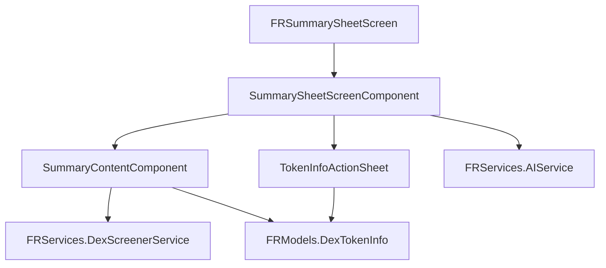

# Refactor FrontrunChatSummarySheetScreen for Frontrun-Eng Compliance

## Overview

Migrate `FrontrunChatSummarySheetScreen.swift` from `submodules/TelegramUI/Sources/` to the proper `Frontrun/FRSummaryUI/` module structure, achieving full compliance with frontrun-eng skill guidelines.

## Problem Statement / Motivation

The current `FrontrunChatSummarySheetScreen.swift` (1,741 lines) violates multiple frontrun-eng principles:

| Violation | Current | Required |
|-----------|---------|----------|
| Location | `submodules/TelegramUI/Sources/` | `Frontrun/FR*UI/` |
| Module naming | No module (inline in TelegramUI) | `FRSummaryUI` module |
| File size | 1,741 lines (6 classes in one file) | Split into focused components |
| Class naming | `ChatSummarySheetScreen` | `FRSummarySheetScreen` (FR prefix) |
| Protocol-first | Direct concrete usage | Protocol for testability |

## Proposed Solution

Create a new `FRSummaryUI` module following frontrun-eng conventions:

```
Frontrun/FRSummaryUI/
├── BUILD
└── Sources/
    ├── FRSummarySheetScreen.swift
    ├── Protocols/
    │   └── FRSummaryPresenterProtocol.swift
    ├── Components/
    │   ├── SummarySheetScreenComponent.swift
    │   └── SummaryContentComponent.swift
    └── Views/
        └── TokenInfoActionSheet.swift
```

## Technical Considerations

### Architecture Impacts

**Dependency Flow:**
```
TelegramUI (ChatController)
    ↓ imports
FRSummaryUI (FRSummarySheetScreen)
    ↓ imports
FRServices (AIService, DexScreenerService)
    ↓ imports
FRModels (DexTokenInfo)
```

**TelegramUI Modifications (minimal):**
- `TelegramUI/BUILD`: Add `//Frontrun/FRSummaryUI:FRSummaryUI` to deps
- `ChatControllerLoadDisplayNode.swift`: Update import and class reference

### Component Separation

| Current Class | New File | Lines | Responsibility |
|---------------|----------|-------|----------------|
| `ChatSummarySheetScreen` | `FRSummarySheetScreen.swift` | ~30 | Entry point, navigation |
| `ChatSummarySheetScreenComponent` | `SummarySheetScreenComponent.swift` | ~510 | Sheet layout, message fetching, AI calls |
| `ChatSummaryContentComponent` | `SummaryContentComponent.swift` | ~950 | Content rendering, markdown, tokens |
| `TokenInfoActionSheetItem` + Node | `TokenInfoActionSheet.swift` | ~220 | Token detail presentation |

### Performance Implications

None expected - structural reorganization only.

### Security Considerations

- Token addresses are displayed but not used for transactions
- No API keys or sensitive data handled in this UI layer
- Existing security patterns maintained

## Acceptance Criteria

### Functional Requirements

- [x] New `Frontrun/FRSummaryUI/` module created
- [x] All 4 component files created with proper separation
- [x] `FRSummarySheetScreen` class follows `FR*` naming convention
- [x] BUILD file correctly declares all dependencies
- [x] TelegramUI BUILD updated with FRSummaryUI dependency
- [x] `ChatControllerLoadDisplayNode.swift` updated to use new import/class
- [x] Original file deleted from `submodules/TelegramUI/Sources/`

### Non-Functional Requirements

- [x] Build succeeds: `bazel build Telegram/Telegram -c dbg --ios_multi_cpus=sim_arm64`
- [ ] No regressions in AI summary functionality
- [ ] No regressions in token detection/display
- [ ] No regressions in message navigation (clicking user tags)

### Quality Gates

- [x] Each component file is self-contained with clear responsibilities
- [x] `UPSTREAM_MODIFICATIONS.md` updated with changes
- [x] No circular dependencies
- [x] Theme colors accessed via `presentationData.theme` (already compliant)

## Implementation Phases

### Phase 1: Create Module Structure

**Create directory and BUILD file:**

```bash
mkdir -p Frontrun/FRSummaryUI/Sources/{Protocols,Components,Views}
```

**Frontrun/FRSummaryUI/BUILD:**

```python
load("@build_bazel_rules_swift//swift:swift.bzl", "swift_library")

swift_library(
    name = "FRSummaryUI",
    module_name = "FRSummaryUI",
    srcs = glob(["Sources/**/*.swift"]),
    copts = ["-warnings-as-errors"],
    deps = [
        # Frontrun modules
        "//Frontrun/FRServices:FRServices",
        "//Frontrun/FRModels:FRModels",

        # Signal kit
        "//submodules/SSignalKit/SwiftSignalKit:SwiftSignalKit",

        # Telegram context and core
        "//submodules/AccountContext:AccountContext",
        "//submodules/TelegramCore:TelegramCore",
        "//submodules/TelegramPresentationData:TelegramPresentationData",
        "//submodules/Postbox:Postbox",

        # Display and AsyncDisplayKit
        "//submodules/Display:Display",
        "//submodules/AsyncDisplayKit:AsyncDisplayKit",

        # Component framework
        "//submodules/ComponentFlow:ComponentFlow",
        "//submodules/ViewControllerComponent:ViewControllerComponent",
        "//submodules/SheetComponent:SheetComponent",
        "//submodules/MultilineTextComponent:MultilineTextComponent",
        "//submodules/Markdown:Markdown",

        # UI components used
        "//submodules/SettingsUI:SettingsUI",
        "//submodules/GlassBarButtonComponent:GlassBarButtonComponent",
        "//submodules/BundleIconComponent:BundleIconComponent",
        "//submodules/AvatarNode:AvatarNode",
        "//submodules/ContextUI:ContextUI",
        "//submodules/UndoUI:UndoUI",
    ],
    visibility = ["//visibility:public"],
)
```

### Phase 2: Create Protocol

**Frontrun/FRSummaryUI/Sources/Protocols/FRSummaryPresenterProtocol.swift:**

```swift
import Foundation
import Postbox

public protocol FRSummaryPresenterProtocol: AnyObject {
    func dismissSummary(animated: Bool)
    func navigateToMessage(_ messageId: MessageId)
    func openSettings()
}
```

### Phase 3: Split and Migrate Components

**File 1: FRSummarySheetScreen.swift** (~60 lines)

```swift
import Foundation
import UIKit
import Display
import AccountContext
import ComponentFlow
import ViewControllerComponent
import TelegramPresentationData
import Postbox

public final class FRSummarySheetScreen: ViewControllerComponentContainer {
    private let context: AccountContext
    private let peerId: PeerId

    public var parentController: () -> ViewController? = { return nil }

    public init(context: AccountContext, peerId: PeerId) {
        self.context = context
        self.peerId = peerId

        super.init(
            context: context,
            component: SummarySheetScreenComponent(context: context, peerId: peerId),
            navigationBarAppearance: .none,
            theme: .default
        )

        self.statusBar.statusBarStyle = .Ignore
        self.navigationPresentation = .flatModal
    }

    required init(coder aDecoder: NSCoder) {
        fatalError("init(coder:) has not been implemented")
    }

    public override func viewDidLoad() {
        super.viewDidLoad()
        self.view.disablesInteractiveModalDismiss = false
    }
}
```

**File 2: Components/SummarySheetScreenComponent.swift** (~510 lines)

Extract the `ChatSummarySheetScreenComponent` class and its nested `View` class, including:
- Message fetching (`fetchMessagesAndGenerateSummary`)
- AI summary generation (`generateAISummary`)
- Title extraction
- Token detail action sheet presentation
- Navigation handlers

**File 3: Components/SummaryContentComponent.swift** (~950 lines)

Extract `ChatSummaryContentComponent` class and its nested `View` class, including:
- Scroll view and text view management
- Token tag processing (`processTokenTags`)
- User tag processing (`processUserTags`)
- Markdown preprocessing
- Avatar loading/caching
- Token info fetching/caching
- Token logo loading
- Full `update()` method with layout logic

**File 4: Views/TokenInfoActionSheet.swift** (~220 lines)

Extract `TokenInfoActionSheetItem` and `TokenInfoActionSheetItemNode` classes, including:
- Token info display
- Placeholder avatar generation
- Layout logic

### Phase 4: Update TelegramUI Integration

**Update submodules/TelegramUI/BUILD:**

```python
deps = [
    # ... existing deps ...
    "//Frontrun/FRServices:FRServices",
    "//Frontrun/FRModels:FRModels",
    "//Frontrun/FRSummaryUI:FRSummaryUI",  # ADD THIS
]
```

**Update ChatControllerLoadDisplayNode.swift:**

```swift
// At top of file, add import:
import FRSummaryUI

// Around line 1567, change:
// FROM:
let controller = ChatSummarySheetScreen(context: strongSelf.context, peerId: peerId)

// TO:
let controller = FRSummarySheetScreen(context: strongSelf.context, peerId: peerId)
```

### Phase 5: Cleanup

- [x] Delete `submodules/TelegramUI/Sources/FrontrunChatSummarySheetScreen.swift`
- [x] Update `docs/guidelines/UPSTREAM_MODIFICATIONS.md`
- [x] Verify build: `bazel build Telegram/Telegram -c dbg --ios_multi_cpus=sim_arm64`

## Files to Create

| File | Purpose |
|------|---------|
| `Frontrun/FRSummaryUI/BUILD` | Module build configuration |
| `Frontrun/FRSummaryUI/Sources/FRSummarySheetScreen.swift` | Entry point controller |
| `Frontrun/FRSummaryUI/Sources/Protocols/FRSummaryPresenterProtocol.swift` | Protocol for testability |
| `Frontrun/FRSummaryUI/Sources/Components/SummarySheetScreenComponent.swift` | Sheet component with AI logic |
| `Frontrun/FRSummaryUI/Sources/Components/SummaryContentComponent.swift` | Content rendering component |
| `Frontrun/FRSummaryUI/Sources/Views/TokenInfoActionSheet.swift` | Token detail action sheet |

## Files to Modify

| File | Change |
|------|--------|
| `submodules/TelegramUI/BUILD` | Add `//Frontrun/FRSummaryUI:FRSummaryUI` dependency |
| `submodules/TelegramUI/Sources/Chat/ChatControllerLoadDisplayNode.swift` | Update import and class name |
| `docs/guidelines/UPSTREAM_MODIFICATIONS.md` | Document changes |

## Files to Delete

| File | Reason |
|------|--------|
| `submodules/TelegramUI/Sources/FrontrunChatSummarySheetScreen.swift` | Migrated to FRSummaryUI |

## Helper Function to Move

The standalone helper function needs to be relocated:

```swift
// Currently at top of file (line 26-31)
private func shortenTokenAddress(_ address: String) -> String {
    guard address.count > 12 else { return address }
    let prefix = address.prefix(6)
    let suffix = address.suffix(4)
    return "\(prefix)...\(suffix)"
}
```

**Options:**
1. Keep in `SummarySheetScreenComponent.swift` as private helper
2. Move to `FRModels` as public extension on String
3. Create `FRSummaryUI/Sources/Utilities/AddressFormatting.swift`

**Recommendation:** Option 1 (keep private) - it's only used by TokenInfoActionSheet

## Cross-Component Dependencies



## Testing Plan

### Manual Testing

1. **Open summary sheet:** Long-press on chat → tap summarize
2. **AI generation:** Verify streaming text appears
3. **Token detection:** Verify `<token>` tags become clickable
4. **Token details:** Tap token → verify action sheet with price/info
5. **Message navigation:** Tap user name → verify navigates to message
6. **Settings access:** Tap gear icon → verify opens AI settings
7. **Dismiss:** Swipe down or tap X → verify dismisses cleanly

### Build Verification

```bash
# Build module in isolation
bazel build //Frontrun/FRSummaryUI:FRSummaryUI -c dbg --ios_multi_cpus=sim_arm64

# Build full app
bazel build Telegram/Telegram -c dbg --ios_multi_cpus=sim_arm64

# Run on simulator
./scripts/run.sh
```

## Risk Analysis

| Risk | Mitigation |
|------|------------|
| Missing imports | Verify BUILD deps include all required modules |
| Circular dependencies | Follow FRModels → FRServices → FRUI hierarchy |
| Runtime crashes | Test all interaction paths manually |
| Build failures | Use incremental approach, build after each phase |

## Success Metrics

- Zero code in `submodules/` that belongs in `Frontrun/`
- All UI components follow `FR*` naming convention
- Clear module boundaries with documented dependencies
- Reduced merge conflict risk during upstream Telegram syncs

## References

### Internal References

- Architecture guide: `docs/guidelines/FRONTRUN_ARCHITECTURE.md`
- Module guide: `docs/guidelines/FRONTRUN_MODULE_GUIDE.md`
- Patterns reference: `.claude/skills/frontrun-eng/references/patterns-condensed.md`
- Rules reference: `.claude/skills/frontrun-eng/references/rules-condensed.md`

### Related Work

- Previous migration: `docs/plans/2026-01-24-refactor-migrate-frontrun-modules-plan.md`
- Integration point: `submodules/TelegramUI/Sources/Chat/ChatControllerLoadDisplayNode.swift:1567`
